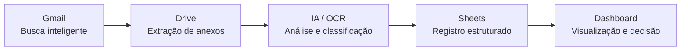

<div align="center">

# 🖥️ Painel de Comando

### Dashboard de Automação do Google Workspace


*Painel web unificado para gerenciamento de Gmail, Google Drive e Google Sheets, com análise inteligente de documentos via IA (OCR).*

</div>

---

## 📋 Sobre o Projeto

O **Painel de Comando** é uma aplicação Python que integra três APIs do Google Workspace (Gmail, Drive e Sheets) em um único painel web, com interface CLI complementar. Inclui um módulo de IA para análise e padronização automática de documentos armazenados no Google Drive, utilizando OCR via Google Cloud Vision API.

### ✨ Funcionalidades

#### 📧 Gmail
- Listar, ler, enviar, responder e encaminhar e-mails
- Operações em lote (arquivar, marcar como lido, excluir)
- Gerenciamento de labels (criar, adicionar, remover)
- Download de anexos

#### 📁 Google Drive
- Navegação em Drives pessoais e compartilhados
- Upload, download, renomear, mover e excluir arquivos
- Criação automática de estrutura de pastas (12 categorias padrão)
- Busca avançada por nome e tipo

#### 📊 Google Sheets
- Leitura e escrita de planilhas
- Criação de novas planilhas e abas
- Exportação para CSV

#### 🤖 Análise Inteligente de Documentos (IA)
- OCR via Google Cloud Vision API
- Classificação automática de documentos por conteúdo (regex + keywords)
- Sugestões de renomeação padronizada
- Processamento em background com fila persistente (SQLite)
- Scanner automático com progresso em tempo real

---

## 🔄 Fluxo de Automação



---

## 🏗️ Arquitetura

```
Painel-de-Comando/
├── app.py                  # Aplicação Flask (rotas API + páginas)
├── cli.py                  # Interface CLI (Click) — 30+ comandos
├── config.py               # Configurações e variáveis de ambiente
├── start_web.py            # Launcher com proteção contra duplicatas
├── setup.py                # Script de instalação automatizada
├── requirements.txt        # Dependências Python
│
├── auth/
│   └── google_auth.py      # OAuth2 com retry e refresh automático
├── gmail/
│   └── gmail_manager.py    # Gerenciador Gmail (batch, labels, retry)
├── drive/
│   └── drive_manager.py    # Gerenciador Drive (shared drives, estrutura)
├── sheets/
│   └── sheets_manager.py   # Gerenciador Sheets (CRUD, export)
├── ai/
│   ├── document_analyzer.py    # OCR + classificação de documentos
│   ├── background_worker.py    # Worker de processamento em background
│   └── analysis_queue.py       # Fila de análise persistente (SQLite)
│
├── templates/              # Templates HTML (Flask/Jinja2)
├── static/                 # CSS e JavaScript
└── logos/                  # Assets visuais
```

---

## 🛠️ Tech Stack

| Categoria | Tecnologias |
|---|---|
| **Linguagem** | Python 3.8+ |
| **Web Framework** | Flask, Flask-CORS |
| **CLI** | Click |
| **Google APIs** | google-api-python-client, google-auth, google-auth-oauthlib |
| **IA / OCR** | Google Cloud Vision API |
| **Dados** | Pandas, SQLite3, PyPDF2 |
| **Config** | python-dotenv |

---

## 🚀 Como Executar

### Pré-requisitos

- Python 3.8+
- Credenciais OAuth 2.0 do [Google Cloud Console](https://console.cloud.google.com/)
- APIs habilitadas: **Gmail API**, **Google Drive API**, **Google Sheets API**
- *(Opcional)* Google Cloud Vision API para análise de documentos com OCR

### Instalação

```bash
# Clone o repositório
git clone https://github.com/lucianomjf14/Painel-de-Comando.git
cd Painel-de-Comando

# Instale as dependências
pip install -r requirements.txt

# Configure as variáveis de ambiente
cp .env.example .env
# Edite o .env conforme necessário

# Coloque seu credentials.json na raiz do projeto
# (baixado do Google Cloud Console → APIs & Services → Credentials)

# Execute o setup automatizado
python setup.py
```

### Interface Web

```bash
python start_web.py
# Acesse: http://localhost:5000
```

**Endpoints disponíveis:**
| Endpoint | Descrição |
|---|---|
| `http://localhost:5000` | Página inicial (Dashboard) |
| `http://localhost:5000/gmail` | Gerenciamento de e-mails |
| `http://localhost:5000/drive` | Navegação no Google Drive |
| `http://localhost:5000/sheets` | Editor de planilhas |
| `http://localhost:5000/settings` | Configurações |

### Interface CLI

```bash
# Autenticação
python cli.py auth login

# Gmail
python cli.py gmail list --max-results 5
python cli.py gmail send --to email@example.com --subject "Teste" --body "Olá!"
python cli.py gmail unread-count

# Drive
python cli.py drive list --max-results 10
python cli.py drive upload --file arquivo.pdf
python cli.py drive search --name "relatório"

# Sheets
python cli.py sheets read --spreadsheet-id ID_DA_PLANILHA
python cli.py sheets create --title "Nova Planilha"
```

---

## 🔐 Segurança

- Autenticação via **OAuth 2.0** (nunca armazena senhas)
- Tokens com **refresh automático**
- Credenciais gerenciadas via **variáveis de ambiente** (`.env`)
- Suporte a ambientes remotos (Codespaces, SSH)
- Arquivo `credentials.json.example` como template (sem dados reais)

---

## 📌 Destaques Técnicos

- **Resiliência**: Retry com backoff exponencial em todas as operações de API
- **Thread Safety**: Locks para acesso concorrente aos serviços Google
- **Batch Operations**: Operações em lote no Gmail (archive, read, delete)
- **Lazy Loading**: Carregamento sob demanda de conteúdo do Drive
- **Cache de Labels**: Cache com TTL configurável para labels do Gmail
- **Singleton Pattern**: Inicialização única dos gerenciadores com double-check locking
- **Cross-platform**: Compatível com Windows, Linux e macOS

---

## Autor

<div align="center">


### Luciano Marinho Silveira

Mestre em Administração | Gestão e Arquitetura Organizacional | Processos, Dados e Inovação | Inteligência Artificial

Juiz de Fora, MG, Brasil

[](https://github.com/lucianomjf14)
[](https://www.linkedin.com/in/luciano-marinho-silveira)
[](https://web.dio.me/users/lucianomjf14)
[](http://lattes.cnpq.br/8717991759915273)
[](mailto:lucianomjf14@gmail.com)

</div>

---

## 📄 Licença

Este projeto está sob a licença MIT. Veja o arquivo [LICENSE](LICENSE) para mais detalhes.
